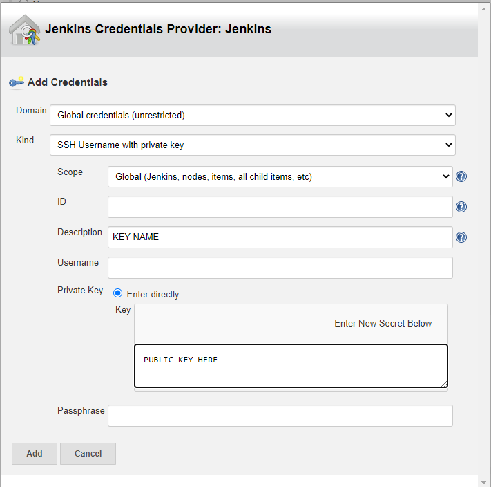
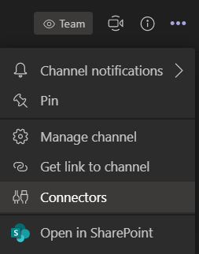
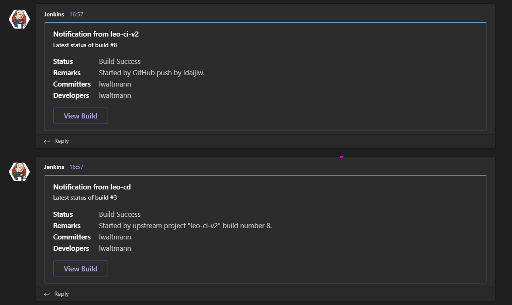

# Sparta NodeJs Sample App DevEnv and CI

Jenkins is an open source automation server used within DevOps to set up CI/CD (Continuous Integration/Continuous Delivery) pipelines that helps to automate testing of new code, providing feedback within seconds, ensuring teams deliver high quality code by the time it is approved for deployment.

This repository uses virtual machines (VM) that contain a development environment to run a Sample App with Node.js, as well as instructions on setting up the first stages of a pipeline on Jenkins.

## Pre-Requisites

- Vagrant
- Virtual Box
- Ruby

[More information on installing and setting up pre-requisites](https://github.com/ldaijiw/vagrant_setup)

## Instructions

### Local Development Environment

In the ``code`` directory there are several key files/directories
- ``Vagrantfile``: Contains all the set up and provisioning instructions when ``vagrant up`` is run
- ``app``: Contains all of the Javascript code for the sample app
- ``environment``: Contains the bash scripts used to make any necessary installations and commands in the VM without requiring the user to SSH into the vagrant machine
- ``nginx_config``: Contains the configuration file to be used in the set up of a reverse proxy with _nginx_
- ``tests``: Contains Ruby tests to verify the VM is configured correctly

With an open terminal, navigate to the ``code`` directory and run
```bash
vagrant up
```

This will set up the database and app VMs, and once the set up is complete the app can be viewed at ``http://development.local``

### Setting Up Testing with Ruby

Testing is carried out with the **Rake** testing framework with **Ruby**, used to ensure that everything is set up and running correctly.

- In ``starter-code/environment/`` there is the ``spec-test`` folder which contains:
	- ``spec`` which contains the specific unit tests that ``rspec`` will refer to
	- ``Gemfile`` which contains a list of gems (packages) that must be installed in order to run the tests
	- ``Rakefile`` which contains the set of instructions to execute the tests
	- ``.rspec`` which can be ignored for now


**In order to install all the gems listed in Gemfile, first install bundler**

- Bundler is Ruby's package manager, which can be installed in terminal with
```bash
gem install bundler
```
- After this is successfully carried out, ensure that the terminal's current working directory is ``starter-code/environment/spec-test`` so that it can refer to the ``Gemfile`` and run
```bash
bundle
```
- This will install all the gems listed in ``Gemfile``, the tests are now ready to be run with
```bash
rake spec
```

If the app is configured correctly, these should all pass.


### Branching with GitHub

Branching is an extremely useful tool in GitHub to enable developers to write new code and utilise the source control management that GitHub offers without having to worry about potentially breaking whatever code is currently live.

Making a new branch, ``B``, will copy all the files/directories in the current branch, ``A``, and changes to code can be made and tested safely in ``B``. If the new feature is approved, it can be _merged_ back into ``A`` where the new code is safely added and integrated.  

In general whatever code is on the ``main`` branch is used in the live environment, i.e. the code being used in the service/product that is deployed to customers. Therefore, any changes that are made on the ``main`` branch should be rigorously tested to ensure everything is functioning correctly and there is no downtime which could result in lost business.

For this project a ``development_env`` branch has been set up from which other branches for specific features can be merged into, as a buffer before merging directly to ``main``.

Any new branches can be made from ``development_env`` with the naming convention: ``dev_<new_feature>`` (**THIS NAMING CONVENTION IS ESSENTIAL FOR THE CORRECT CONFIGURATION OF JENKINS**)

- First ensure that the current branch is ``development_env``
```bash
git checkout development_env
```
- And that it is up to date
```bash
git pull
```
- Create a new branch
```bash
git checkout -b dev_<new_feature>
```

## Setting Up Jenkins

Jenkins can be set up to receive any code changes from a Github repository via a webhook (_any changes are set up to be automatically sent to Jenkins, rather than Jenkins constantly checking for changes_)

Jenkins then sends the code to an _Agent Node_ (i.e. the testing environment) where the code is
- Setup
- Tested

If anything fails, Jenkins provides feedback to the Dev team so they can make any necessary changes.

**In this project, two jobs are set up in Jenkins:**

- The first is used to run tests on the app to ensure everything is running correctly
- If the tests all pass, the second job is then triggered to merge to the development branch on GitHub
- An optional extra configuration is to set up Jenkins to report the status of the job (i.e. success or failure) on Microsoft Teams

Create a new Item in Jenkins, for now selecting _Freestyle Project_, where there are several settings to configure

### General
- **Description**: optional
- **Discard old builds**: turn on with 2 (optional) max number of builds to keep
- **GitHub project**: project url (e.g. ``https://github.com/user/repo_name``)

### Office 365 Connector
- **Restrict where this project can be run**: logical expression to specify which agent to execute builds of the project (e.g. ``sparta-ubuntu-node``)

### Source Code Management

Select **Git**, this is where the connection to the GitHub repository can be configured

- **Repository URL**: URL for repo found in _Code_-->_Clone_-->_SSH_ (e.g. ``git@github.com:user/repo_name.git``)
- **Credentials**: This is where the SSH key is added

**SSH Keys with Jenkins and Github**

- Navigate to directory where SSH keys are stored with
```bash
cd ~/.ssh
```
- Generate a new SSH key with
```bash
ssh-keygen -t ed25519
```
- Enter the file name to save the key to after being prompted, and leave the passphrases empty
- Add the private key (file with no ``.pub`` extension) to GitHub (_Settings_-->_SSH and GPG keys_-->_New SSH key_)
- Add the public key (file with ``.pub`` extension) to Jenkins by _adding a key_


- **Branches to build**: specify which branch to build with ``dev_*``, for this project any branch to be built should have the naming convention ``dev_<new_feature>``

### Build Environment

- **Provide Node & npm bin/folder to PATH**: This must be checked as ``npm`` tests are run on the Sample app

### Build

Add a build step with _Add build step_-->_Execute shell_ with the following lines of code to execute the tests
```bash
cd code/app
npm install
npm test
```

### Build Triggers

- **GitHub hook trigger for GITScm polling**: Check this option to trigger Jenkins to build when detecting pushes from the GitHub repository

### Setting Up a Webhook

The final step is crucial to setting up the communication between GitHub and Jenkins.

Setting up the webhook allows GitHub to trigger Jenkins to start a new build whenever a new commit is pushed.

In the GitHub repository that is to be linked to Jenkins, create a new Webhook (_Settings_-->_Webhooks_-->_Add webhook_)

- **Payload URL**: Add the URL (usually specified with ip and port) with ``/github-webhook/`` appended at the end
- **Content type**: Select ``application/json``

Any new pushes to the repository should now trigger a new build, shown in _Build History_ where the _Console Output_ can be read for each individual build

### Setting Up Jenkins Job to Merge Code

Create another new _Freestyle Project_ in Jenkins with the following differences in settings

**Source Code Management: Additional Behaviours**

Create an additional behaviour with _Additional Behaviours_-->_Add_-->_Merge before build_ with the following settings:
- _Name of repository_: origin
- _Branch to merge to_: development_env
- _Merge strategy_: default
- _Fast-forward mode_: -ff

**Build Triggers: Triggers from Stable Builds of Other Projects**

Instead of selecting the GitHub trigger, select _Build after other projects are built_ with the following settings:
- _Projects to watch_: <name_of_first_job>
- _Trigger only if build is stable_

**Node/npm PATH and Build Steps are Both not Needed**

**Post-build Actions**

Add a post-build action with _Add post-build action_-->_Git Publisher_ with the following settings:
- _Push Only If Build Succeeds_
- _Merge Results_

### Setting Up Jenkins and MS Teams

Both Jenkins jobs can be configured to send notifications of successful/failed builds via MS Teams

In the teams channel that is to be used to receive Jenkins notifications, create a new connector



Configure a new Jenkins connector and enter a name for the connection

Copy the URL and create a new webhook in Jenkins via _Office 365 Connector_-->_Add Webhook_, and paste the URL and name used for the connector in the relevant fields

If both Jobs are configured in this way, a new GitHub push that passes all tests should result in two success messages from Jenkins

